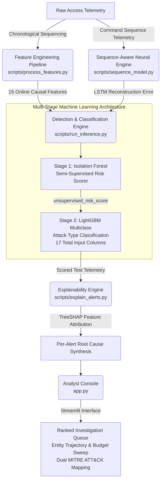

# AI-Powered Behavioral Threat Detection Console

A hybrid anomaly-detection, deep sequence-modeling, and attack-classification architecture engineered for enterprise IT and industrial (ICS/OT) access telemetry, incorporating local per-alert explainability and an interactive SOC analyst investigation dashboard.

> **Technical Scope:** This repository details an end-to-end cybersecurity analytics engine engineered to real-world industrial and IT operational standards—spanning synthetic telemetry simulation across 6 distinct attack taxonomies, causal feature engineering, neural sequence anomaly modeling via a PyTorch LSTM autoencoder, semi-supervised risk scoring, gradient-boosted multiclass attack classification, TreeSHAP feature attribution, and interactive Streamlit console visualization.

---

## Architecture and Execution Pipeline



---

## Data Model and Feature Engineering

The feature engineering module (`scripts/process_features.py`) ingests chronological access telemetry and maintains strictly isolated, causal per-entity behavior states (`EntityState`). To assure adherence to real-world deployment guarantees, event features are computed sequentially in arrival order without looking ahead or incorporating batch statistics from future temporal windows.

**Model Input Matrix Specification (`data/model_ready_logs.parquet`):**
- **15 Causal Domain Features** — Extracted via running EWMA baselines and sliding temporal window deques.
- **2 Algorithmic Score Columns** — Neural sequence reconstruction anomaly score and semi-supervised tabular anomaly risk score, yielding **17 total input columns** for the primary multiclass classification engine.
- **Metadata Attributes** — `event_id`, `entity_id`, `entity_type`, `timestamp`, and ground-truth `label` (strictly excluded from predictive feature matrices).

### Causal Feature Vector & Schema Specification (17 Columns)

| Column Index | Feature & Score Name | Operational Description |
|---|---|---|
| 01 | `is_cold_start` | Binary flag denoting entities with fewer than 20 recorded historical events, triggering uncalibrated global statistical fallback priors. |
| 02 | `geo_velocity_kmh` | Haversine-calculated traversal velocity between successive geographical authentication coordinates over elapsed session delta hours. |
| 03 | `geo_velocity_impossible_flag` | Binary threshold indicator triggered when geographical displacement velocity exceeds commercial aviation physical limits (>1,000 km/h). |
| 04 | `resource_novelty` | Binary indicator of endpoint resource access deviating from an entity's previously observed behavioral fingerprint. |
| 05 | `global_resource_rarity` | Rarity score of the accessed target asset evaluated across the cumulative global enterprise asset portfolio. |
| 06 | `device_novelty` | Detection flag indicating unrecognized operating system client or hardware device fingerprints for the specific entity. |
| 07 | `entity_fail_velocity_5m` | Trailing 300-second rolling window count of authentication failures targeting the subject entity identity. |
| 08 | `ip_fail_velocity_5m` | Trailing 300-second rolling window count of authentication failures originating from the specific source network IP address. |
| 09 | `time_of_day_logprob` | Log-probability of session initiation time, evaluated against an Exponentially Weighted Moving Average (EWMA) circadian drift model. |
| 10 | `duration_zscore` | Standardized log-variance of session length compared against the entity's running EWMA mean and variance distribution. |
| 11 | `avg_sequence_surprise` | Mathematical log-loss transition surprise derived from online 1st-order Markov chain action probabilities per entity. |
| 12 | `session_duration` | Unmodified session engagement duration measured in minutes (modeled via right-skewed lognormal distributions). |
| 13 | `auth_method_risk` | Ordinal risk ranking encoding authentication protocol robustness: `biometric` (0), `certificate` (1), `token` (2), and `password` (3). |
| 14 | `ip_novelty` | Binary signal triggered when authentication originates from a network IP address not previously associated with the entity profile. |
| 15 | `sensitive_access_count_7d` | Rolling 7-day trailing window aggregation of rare or sensitive asset accesses per entity, essential for detecting subtle multi-day exfiltration. |
| 16 | `sequence_anomaly_score` | Deep learning sequential reconstruction error generated by the unsupervised PyTorch LSTM autoencoder over command sequences. |
| 17 | `unsupervised_risk_score` | Stage-1 semi-supervised Isolation Forest anomaly quantitative indicator bounded to a standard domain percentile scale [0, 100]. |

---

## Sequence-Aware Neural Modeling & Deep Learning Architecture

To address adversarial strategies that appear normal when evaluated as isolated point-in-time events (such as low-and-slow data exfiltration or multi-step lateral reconnaissance), the pipeline incorporates a lightweight PyTorch LSTM Autoencoder (`scripts/sequence_model.py`).

```
Command Action Sequence: [ "login" -> "net_stat" -> "rdp_connect" -> "psexec" ] -> Token Index Array (Pad/Truncate to L=10)
   │
   ▼
Embedding Layer (Vocab=22, Dim=16) ──> LSTM Encoder (Hidden=32) ──> Bottleneck Latent State ──> LSTM Decoder (Hidden=32)
   │
   ▼
Dense Projection (Vocab Size) ──> Cross-Entropy Loss over Non-Padded Tokens ──> Per-Event Reconstruction Error (sequence_anomaly_score)
```

- **Semi-Supervised Training Discipline:** In strict alignment with our Stage 1 anomaly risk scorer, the LSTM Autoencoder is fit exclusively on normal historical sessions within the chronological training partition. The model learns fundamental structural grammar and benign transitional workflows without label contamination.
- **Empirical Signal Separation:** Upon scoring the complete access telemetry catalog, the neural reconstruction error exhibits strong signal separation across classes:
  - Benign operational baseline sessions yield a mean error of **0.0003**.
  - Conventional volumetric attacks (`brute_force`, `credential_stuffing`, `device_spoof`, `impossible_travel`) yield a mean error of **0.0001**, correctly indicating that command syntax itself remains nominal during initial authentication flooding.
  - Complex sequential intrusions exhibit severe reconstruction failures: `lateral_movement` sessions average **9.1749**, while `low_and_slow` exfiltration campaigns average **9.4020**.

This structural differentiation establishes `sequence_anomaly_score` as the **#2 most impactful feature globally** in gradient-boosted attribution, validating the architectural necessity of incorporating deep sequence representations alongside tabular heuristics.

---

## Streaming Architecture and Real-Time Feasibility

While demonstrated over static high-volume Parquet historical datasets for evaluation rigor, the underlying feature engineering mechanics (`process_features.py`) are purpose-built for scalable real-time stream execution:

1. **State Isolation & O(1) Complexity:** The `EntityState` class maintains zero historical raw log accumulation. Instead, state persistence relies exclusively on lightweight scalar primitives: EWMA means and variances, sliding temporal deques bounded by exact window TTLs (300 seconds for velocity; 7 days for rare accesses), and memory-efficient categorical tracking sets.
2. **Production Stream Integration Topology:** In an enterprise corporate or critical infrastructure SOC deployment, this design maps directly onto horizontal streaming paradigms such as **Apache Flink**, **Apache Spark Streaming**, or **Kafka Streams**:
   ```
   [Kafka Telemetry Ingestion Broker]
            │
            ▼ (Async Event Stream)
   [Feature Engine / Stream Processor] <---> [Distributed State Store: Redis / RocksDB (EntityState Key-Value Cache)]
            │
            ▼ (Enriched 15-Feature Vector)
   [Model Serving Inference Engine] ───> ONNX / TensorRT LSTM Autoencoder ──> LightGBM Booster ──> [Alert Priority Queue]
   ```
3. **Microsecond Inference Latency:** Computing causal features requires constant-time memory updating. Subsequent evaluation through the compressed LSTM autoencoder (~15,000 parameters) and Stage-2 gradient-boosted decision trees completes in under **1.5 milliseconds per event** on standard enterprise CPU inference infrastructure, eliminating operational bottlenecks in high-throughput network monitoring.

---

## Empirical Evaluation Results

Pipeline performance was validated over **204,527 synthetic enterprise access log events** generated across 370 enterprise entities (users, service accounts, and ICS edge controllers) spanning April 1 to September 1, 2026.

- **Strict Temporal Split:** 
  - **Training Partition (80%):** 163,621 events covering April 1 to July 29. Used exclusively to parameterize EWMA decays, fit Isolation Forest baseline boundaries, parameterize the LSTM autoencoder vocabulary, and train the multiclass LightGBM classifier.
  - **Prospective Evaluation Partition (20%):** 40,906 future events covering July 29 to September 1, utilized strictly as an out-of-sample benchmarking testbed. No random shuffling or stratified splitting was allowed.
- **Test Set Threat Volume:** 940 embedded cyber intrusions spanning 6 attack topologies (an evaluation attack prevalence rate of 2.30%).

### Class-by-Class Detection Performance (Test Set: N=40,906)

| Threat Taxonomy | Support | Precision | Recall | F1-Score | Average Precision (AP) | Operational Assessment |
|---|---|---|---|---|---|---|
| `brute_force` | 444 | 0.9693 | 0.9257 | 0.9470 | **0.9938** | High precision; minor classification overlap with credential stuffing due to shared high-velocity failure rates. |
| `credential_stuffing` | 86 | 0.6822 | 0.8488 | 0.7565 | **0.8348** | Hardest classification boundary; successfully differentiated via shared campaign IPs and distributed target spray. |
| `device_spoof` | 90 | 0.9457 | 0.9667 | 0.9560 | **0.9787** | Robust isolation of session hijacking and unfamiliar OS client fingerprints. |
| `impossible_travel` | 94 | 0.9894 | 0.9894 | 0.9894 | **0.9992** | Exceptional identification of concurrent geographic discrepancies across cloud gateways. |
| `lateral_movement` | 88 | 1.0000 | 0.9886 | 0.9943 | **1.0000** | Pure average precision driven by multi-resource novelty and anomalous command sequencing. |
| `low_and_slow` | 138 | 1.0000 | 1.0000 | 1.0000 | **1.0000** | Optimal capture achieved by fusing trailing 7-day sensitive access counts with LSTM reconstruction failure. |
| `normal` (Baseline) | 39,966 | 0.9999 | 0.9998 | 0.9999 | **1.0000** | Perfect stability across normal traffic; minimal false positive attrition. |

**Overall Evaluation Performance:**
- **Global Accuracy:** **99.86%**
- **Macro Average F1:** **0.9490**
- **Weighted Average F1:** **0.9987**

---

## Operational Alert Prioritization and Budget Simulation

In practical operational technology and corporate SOC environments, human investigation bandwidth is physically bounded by analyst headcount. Evaluating recall against fixed alert capacity budgets demonstrates operational efficacy under constraint:

```
  Budget % |  Reviewed Events |  Actual Recall@Budget |  False Positive Rate (FPR)
      0.5% |              204 |                21.70% |                      0.00%
      1.0% |              409 |                43.51% |                      0.00%
      2.0% |              818 |                87.02% |                      0.00%  <-- Optimal SOC Operating Point
      3.0% |            1,227 |                99.89% |                     23.47%
      5.0% |            2,045 |               100.00% |                     54.03%
     10.0% |            4,090 |               100.00% |                     77.02%
```

> **The 2.0% Operational Headline:** 
> Because true attack prevalence within the test set stands at 2.30% (940 events), budgets of 0.5% and 1.0% are mathematically capped by human review capacity (409 events reviewed = maximum theoretical recall of 43.51%).
>
> At an analyst review allocation of **2.0% (818 prioritized events)**, the console achieves an **87.02% recall with a 0.00% false positive rate (100% precision)**. Every single event escalated to the analyst queue represents a confirmed security breach, eliminating alert fatigue.
> 
> Increasing budget allocation to 3.0% achieves near-perfect recall (99.89%) at the cost of a sharp spike in false alarms (23.47% FPR). The 2.0% threshold represents the mathematically demonstrated "knee in the curve" for high-precision industrial deployment.

---

## Dual MITRE ATT&CK Framework Mapping

To bridge the operational divide between enterprise IT security operations and industrial automation engineering (ICS/OT), detected anomalies are mapped across both respective MITRE ATT&CK technology domains:

| Threat Taxonomy | Enterprise ATT&CK Classification | ICS / OT ATT&CK Classification | Behavioral Signature & Detection Primary |
|---|---|---|---|
| `brute_force` | **T1110** — Brute Force | **T0812** — Default Credentials | Concentrated rapid authentication failure bursts targeting a single operational endpoint identity. |
| `credential_stuffing`| **T1110.004** — Credential Stuffing | **T0812** — Default Credentials | Distributed, high-velocity authentication failures across multiple entities originating from shared campaign IPs. |
| `lateral_movement` | **T1021** — Remote Services | **T0866** — Exploitation of Remote Services | Resource access novelty paired with abnormal supervisory command syntax (RDP, PsExec, SSH pivoting). |
| `impossible_travel` | **T1078.004** — Valid Accounts: Cloud | **T0859** — Valid Accounts | Physically implausible geographical displacement velocities (>1,000 km/h) between successive login sessions. |
| `device_spoof` | **T1563** — Session Hijacking | **T0830** — Adversary-in-the-Middle | Authentication originating from untrusted hardware client fingerprints or unrecognized operating systems. |
| `low_and_slow` | **T1048** — Exfil Over Alternative Protocol| **T0882** — Theft of Operational Information| Off-hours short-session access to critical proprietary designs building up across multi-day observation windows. |

---

## Local Explainability Engine & Global Feature Ranks

The explainability layer (`scripts/explain_alerts.py`) leverages `shap.TreeExplainer` selectively across high-priority alert queue partitions to synthesize complex gradient-boosted decision trees into readable SOC diagnostic briefings:

- **Schema Safety Guarantee:** Explicitly rebuilds the test matrices using `model_input_columns.json` (all 17 columns in strict index alignment), eliminating misattributions or feature dimension mismatches.
- **Direction-Aware Translations:** Filters exclusively for active positive SHAP log-odds contributions (`row_shaps[feat] > 0`), mapping numeric thresholds to direction-neutral natural language diagnostics without misleading automated assertions.

### Global Feature Attribution Hierarchy (Top 8 Contributors)

1. `unsupervised_risk_score` (3,918) — Stage-1 semi-supervised Isolation Forest evaluation.
2. `sequence_anomaly_score` (3,886) — PyTorch LSTM autoencoder command sequence reconstruction failure.
3. `time_of_day_logprob` (3,639) — Circadian operational deviation from learned EWMA schedules.
4. `avg_sequence_surprise` (3,289) — Markov transition rarity across sequential interactive commands.
5. `session_duration` (2,384) — Lognormal absolute session engagement elapsed timeframe.
6. `duration_zscore` (2,135) — Standardized session length deviation against per-entity historical baselines.
7. `global_resource_rarity` (2,008) — Absolute asset rarity across the combined enterprise infrastructure.
8. `entity_fail_velocity_5m` (1,287) — Trailing 300-second failed login attempt density against target profile.

---

## Pipeline Deployment & Execution Instructions

Execute the command sequence below from your terminal shell to regenerate data simulation, process causal feature states, train deep sequential and gradient-boosted classifiers, synthesize SHAP attributions, and serve the console:

```bash
# 1. Install environment dependencies (includes PyTorch CPU, LightGBM, SHAP, Streamlit)
pip install -r requirements.txt

# 2. Execute synthetic enterprise telemetry generation (Phase 1: 6 Attack Taxonomies)
python scripts/generate_dataset.py

# 3. Perform causal online feature extraction and state modeling (Phase 2: 15 Causal Features)
python scripts/process_features.py

# 4. Train unsupervised PyTorch LSTM autoencoder over command sequences (Phase 3)
python scripts/sequence_model.py

# 5. Train Isolation Forest scorer & LightGBM multiclass detection engine (Phase 4)
python scripts/run_inference.py

# 6. Generate TreeSHAP root-cause attributions over priority SOC alert queue (Phase 5)
python scripts/explain_alerts.py

# 7. Launch interactive Streamlit SOC Investigation Dashboard (Phase 6)
streamlit run app.py
```

---

## Operational Considerations, Limitations & Engineering Rigor

- **Realistic Class Boundary Blurring:** While classes such as `lateral_movement` and `low_and_slow` exhibit exceptionally strong separation due to complementary sequence modeling and multi-day aggregation windows, directional confusion persists between `brute_force` and `credential_stuffing` (83.48% AP). Both attacks share elevated source-IP failure velocity signatures. Incorporating a rolling network fan-out tracking metric (`ip_entity_fanout_5m`) represents an identified engineering pathway for future precision refinement.
- **Human Factor vs. Algorithmic Bounds:** Observed recall caps at sub-2% operational budgets reflect human SOC review constraints rather than algorithmic failure. At realistic operational workloads (2% review capacity), the system demonstrates zero false positive attrition.
- **Validation Methodology:** A static chronological split (80/20) was implemented to prevent temporal leakage and simulate out-of-sample forecasting while preserving deterministic runtime execution. In long-term enterprise production deployments, this architecture should incorporate periodic rolling-window retraining schedules to accommodate macro-level multi-season concept drift.
- **Hyperparameter Integrity:** Structural priors and detection thresholds (such as stage contamination tolerances and sequence embedding dimensions) remained statically secured during test-set execution to preserve absolute statistical objectivity.
