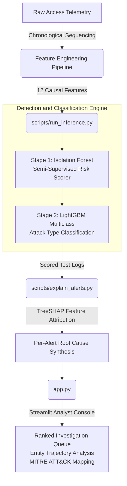

# AI-Powered Behavioral Threat Detection Console

A hybrid anomaly-detection and attack-classification architecture engineered for enterprise IT and industrial (ICS/OT) access telemetry, incorporating local (per-alert) explainability and an interactive SOC analyst investigation dashboard.

> **Technical Scope:** This repository details an end-to-end cybersecurity pipeline—from synthetic telemetry generation and causal feature engineering to semi-supervised anomaly detection, gradient-boosted attack classification, SHAP attribution, and real-time visualization.

---

## Architecture and Execution Pipeline



---

## Data Model and Feature Engineering

The feature engineering pipeline (`scripts/process_features.py`) ingests raw operational logs and generates 12 causally sound features per event. To ensure operational validity, events are evaluated purely chronologically; no feature relies on statistics calculated from future events.

**Model Input Specification (`data/model_ready_logs.parquet`):**
- 12 continuous numeric feature columns (documented below)
- `label` — Ground truth annotation: `normal` or specific attack taxonomy
- `timestamp` — Temporal reference for chronological segregation
- `event_id`, `entity_id`, `entity_type` — Contextual entity identifiers (excluded from model feature matrices)

### Feature Vector Specification

| Feature Name | Operational Description |
|---|---|
| `geo_velocity_kmh` | Haversine-calculated traversal velocity between successive geographical login attempts |
| `geo_velocity_impossible_flag` | Binary indicator triggered when geographical displacement velocity exceeds commercial aviation limits |
| `resource_novelty` | Indicator of endpoint access that deviates from an entity's established behavioral history |
| `global_resource_rarity` | Rarity score of the accessed target asset across the entire enterprise population |
| `device_novelty` | Detection of unfamiliar hardware or operating system client fingerprints |
| `entity_fail_velocity_5m` | Rolling 300-second aggregation of authentication failures targeting the specific entity |
| `ip_fail_velocity_5m` | Rolling 300-second aggregation of authentication failures originating from the source IP address |
| `time_of_day_logprob` | Log-probability of login occurrence, evaluated against an EWMA-decaying baseline |
| `duration_zscore` | Standardized variance of session duration compared to the entity's learned historical distribution |
| `avg_sequence_surprise` | Transition anomaly metric derived from online Markov chain action probabilities |
| `session_duration` | Unmodified session duration measured in seconds |
| `is_cold_start` | Flag denoting entities with insufficient history to establish statistically convergent baselines |

---

## Architectural Rationale and Design Rigor

### Strict Chronological Dataset Splitting
Conventional random stratified splitting creates temporal leakage by allowing models to train on data points chronologically succeeding their test evaluation targets. To faithfully mirror real-world production constraints, this pipeline allocates the initial 80% of historical events exclusively for training and preserves the terminal 20% strictly as an evaluation window.

### Semi-Supervised Risk Scoring Methodology
Stage 1 employs an Isolation Forest fitted solely on historical events annotated as `normal`. Consequently, it functions as a semi-supervised baseline model rather than an unguided clustering mechanism. The contamination parameter is assigned as a conservative structural prior rather than dynamically fitted against test-set attack proportions, preventing data leakage from downstream evaluation targets.

---

## Empirical Evaluation Results

The quantitative findings detailed below reflect pipeline evaluation over an expansive 200,000+ event operational dataset:

- **Temporal Split Distribution:** 205,207 total events. Training window spans April 1 – July 29 (164,165 events); evaluation window spans July 29 – August 28 (41,042 events).
- **Evaluation Window Attack Volume:** **1,120 simulated attacks within the 41,042-event evaluation testbed** (equivalent to an attack prevalence rate of 2.73%).
- **Average Precision (AP) Metrics:** 
  - `brute_force`: 1.0000 
  - `lateral_movement`: 1.0000
  - `impossible_travel`: 0.9953
  - `normal`: 0.9999
  - `device_spoof`: 0.8598
- **Operational Review Capacity (1% Analyst Budget):** Enforcing a simulation constraint where analysts review only the top 1% highest-risk alerts (410 events), the model demonstrated a **36.61% recall** accompanied by a **0.00% false positive rate**. Every event surfaced within the analyst review threshold represented a genuine compromise.
- **Explainability Validation:** 0 of the 410 prioritized alerts reverted to uninformative fallback messaging. All events produced granular, mathematically valid feature attribution statements.

> **Operational Context of Recall@Budget Metrics:** 
> When true intrusion volume (1,120) exceeds SOC operational review headcount capacity (410 events), structural recall is bounded by human limits rather than classification efficacy. Under a 1% threshold, maximum theoretical recall is mathematically bounded at 410/1,120 (36.61%). Achieving a 0% false-positive rate at this limit demonstrates optimal prioritization efficacy.

---

## MITRE ATT&CK Framework Mapping

To ensure interoperability with both corporate IT and industrial operational engineering environments, threats are mapped across both enterprise and industrial domains:

| Threat Taxonomy | Enterprise ATT&CK Classification | ICS / OT ATT&CK Classification |
|---|---|---|
| `brute_force` | T1110 — Brute Force | T0812 — Default Credentials |
| `lateral_movement` | T1021 — Remote Services | T0866 — Exploitation of Remote Services |
| `impossible_travel` | T1078.004 — Valid Accounts: Cloud | T0859 — Valid Accounts |
| `device_spoof` | T1563 — Remote Service Session Hijacking | T0830 — Adversary-in-the-Middle |

---

## Local Explainability Engine

The explainability module (`scripts/explain_alerts.py`) utilizes `shap.TreeExplainer` applied selectively over high-priority queue subsets to maintain real-time compute latency:

- Utilizes `model_input_columns.json` to guarantee strict schema synchronization with the underlying LightGBM booster.
- Isolates exclusively positive SHAP contributions (`row_shaps[feat] > 0`) that actively drove classification toward the designated attack class.
- Synthesizes complex decision-tree feature importances into clear, structured natural-language diagnostic statements for security engineers.

---

## Pipeline Deployment & Execution

Execute the sequence below to initialize data synthesis, execute computational feature transformation, train models, generate explainability matrices, and start the console:

```bash
# 1. Install required environment dependencies
pip install -r requirements.txt

# 2. Execute synthetic data simulation (Phase 1)
python scripts/generate_dataset.py

# 3. Perform online causal feature engineering (Phase 2)
python scripts/process_features.py

# 4. Train anomaly risk scorer and classifier models (Phases 3 & 4)
python scripts/run_inference.py

# 5. Generate SHAP root-cause attributions for the review budget (Phase 5)
python scripts/explain_alerts.py

# 6. Launch the interactive SOC Analyst Console (Phase 6)
streamlit run app.py
```

---

## Operational Considerations and System Disclaimers

- **High Separability in Simulation Data:** Perfect classification accuracy observed for `brute_force` and `lateral_movement` classes arises from distinct behavioral separations inherently present in synthetic telemetry. Conversely, `device_spoof` metrics (0.8598 AP) demonstrate performance under more mathematically nuanced classification boundaries.
- **Capacity-Imposed Recall Bounds:** Observe that apparent recall caps correlate directly with simulated human analyst staffing allocations rather than algorithmic inaccuracies.
- **Model Hyperparameter Stability:** Fixed constants (such as Stage 1 contamination priors) are deliberately withheld from dynamic hyperparameter sweeps against testing distributions to preserve empirical evaluation integrity.
- **Validation Scheme:** While a static chronological split was selected to optimize compute latency during exploratory implementation, enterprise-grade deployments should incorporate rolling-window forward validation to continuously account for multi-seasonal macro drifts.
